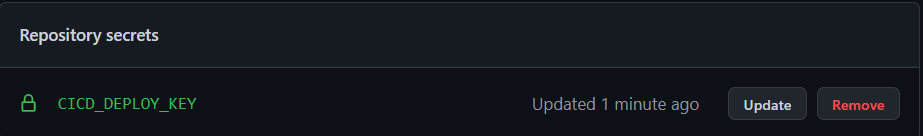

# cicd-sample-application

## Deploy key settings

Access to [k8s-manifest-repo](https://github.com/toyamagu-2021/cicd-sample-k8s-manifest) using deploy key.

- `ssh-keygen -t rsa -N "" -C "cicd-deploy-key" -f cicd-deploy-key`
- Register secret key to application repo
  - Get private key: `cat cicd-deploy-key`
  - Move to settings -> Secrets -> Actions
  - Register secret `CICD_DEPLOY_KEY`
    
- Register deploy key to k8s manifest repo
  - Get public key: `cat cicd-deploy-key.pub`
  - Move to settings -> Deploy keys
  - Register deploy key `cicd-deploy-key` with write permission
